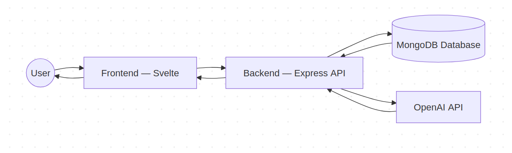
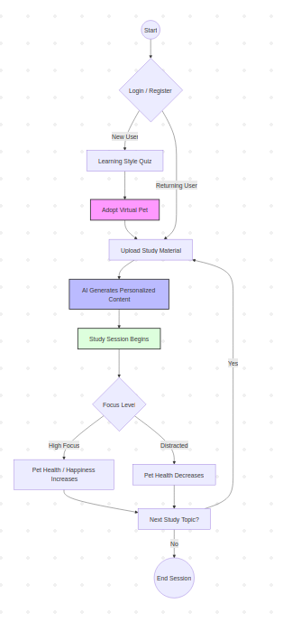

# Focus Pet 🎯

## Basic Details

**Team Name:** Vega

## Team Members

- Sneha Sooraj — Saintgits College of Engineering  
- Varsha Ann Biju — Saintgits College of Engineering  

## Hosted Project Link

http://localhost:5173  
*(Replace with deployed link — Vercel / Netlify / Render)*

---

## Project Description

Focus Pet is an AI-powered study companion that adapts to a user's learning style while keeping them focused through a virtual pet system. The pet’s health depends on user attention — switching tabs harms it, sustained focus revives it. The system also generates personalized learning materials from uploaded documents.

---

## The Problem Statement

Students struggle to stay focused while studying online due to distractions, lack of personalization, and passive learning methods.

---

## The Solution

Focus Pet combines AI-generated personalized content with gamified focus tracking. It detects learning styles, creates tailored study materials (visual/audio/read/active), and uses a virtual pet whose survival depends on the student’s attention.

---

## Technical Details

### Technologies/Components Used

#### For Software

**Languages used:**

- JavaScript  
- HTML  
- CSS  

**Frameworks used:**

- Svelte  
- Node.js  
- Express  

**Libraries used:**

- OpenAI SDK  
- Mongoose  
- Multer (file uploads)  

**Tools used:**

- VS Code  
- Git & GitHub  
- MongoDB Atlas  
- Vite  

---

## Features

- Learning style detection quiz  
- AI-generated personalized study materials  
- Upload PDF/PPT/images for analysis  
- Virtual focus pet with health system  
- Tab-switch detection (distraction tracking)  
- Pet revival through sustained focus  
- Gamified learning experience  

---

## Implementation

### For Software

#### Installation

```bash
# Clone repo
git clone https://github.com/yourusername/focus-pet.git

# Backend setup
cd backend
npm install

# Frontend setup
cd ../frontend
npm install
````

#### Run

```bash
# Start backend
cd backend
node index.js

# Start frontend
cd frontend
npm run dev
```

---

## Project Documentation

### Screenshots

### Login / Signup


### Quiz Results


### Pet Adoption


### Upload Files


### Personalized Content


### Dashboard


---

## Diagrams




The frontend collects user input and files, backend processes requests, stores user data, and uses AI services to generate personalized content.

---

### Application Workflow



---

## Additional Documentation

### API Documentation

**Base URL:** [http://localhost:5000](http://localhost:5000)

#### POST /api/auth/register

Register new user

**Request Body:**

```json
{
  "username": "Sneha",
  "email": "test@mail.com",
  "password": "123456"
}
```

#### POST /api/quiz/submit

Submit learning style

```json
{
  "userId": "123",
  "result": "visual"
}
```

#### POST /api/pet/adopt

Adopt study pet

```json
{
  "petName": "Coco",
  "petEmoji": "🐶"
}
```

#### POST /api/session/create

Create study session

```json
{
  "topic": "Machine Learning",
  "duration": "1 hour"
}
```

---

## Project Demo

Google Drive Link - https://drive.google.com/drive/folders/1gk1OPQEfAyicRtDrLGeMlcML1WyjHZyM

**Video demonstrates:**

* Registration flow
* Quiz
* Pet adoption
* Study session
* Focus tracking

---

## AI Tools Used (Optional — Transparency Bonus)

**Tool Used:** ChatGPT / Gemini

**Purpose:**

* Code generation
* Debugging
* Feature suggestions
* Documentation

**Key Prompts Used:**

* “Generate backend API for quiz submission”
* “Create Svelte UI for virtual pet system”
* “Implement focus tracking logic”

**Estimated AI-generated code:** ~40%

**Human Contributions:**

* System design
* Integration
* Testing
* UI decisions

---

## Team Contributions

**Sneha Sooraj:**
Frontend development, UI design, integration

**Varsha Ann Biju:**
Backend development, database design

---

## License

This project is licensed under the MIT License.

---

**Made with ❤️ at TinkerHub**
