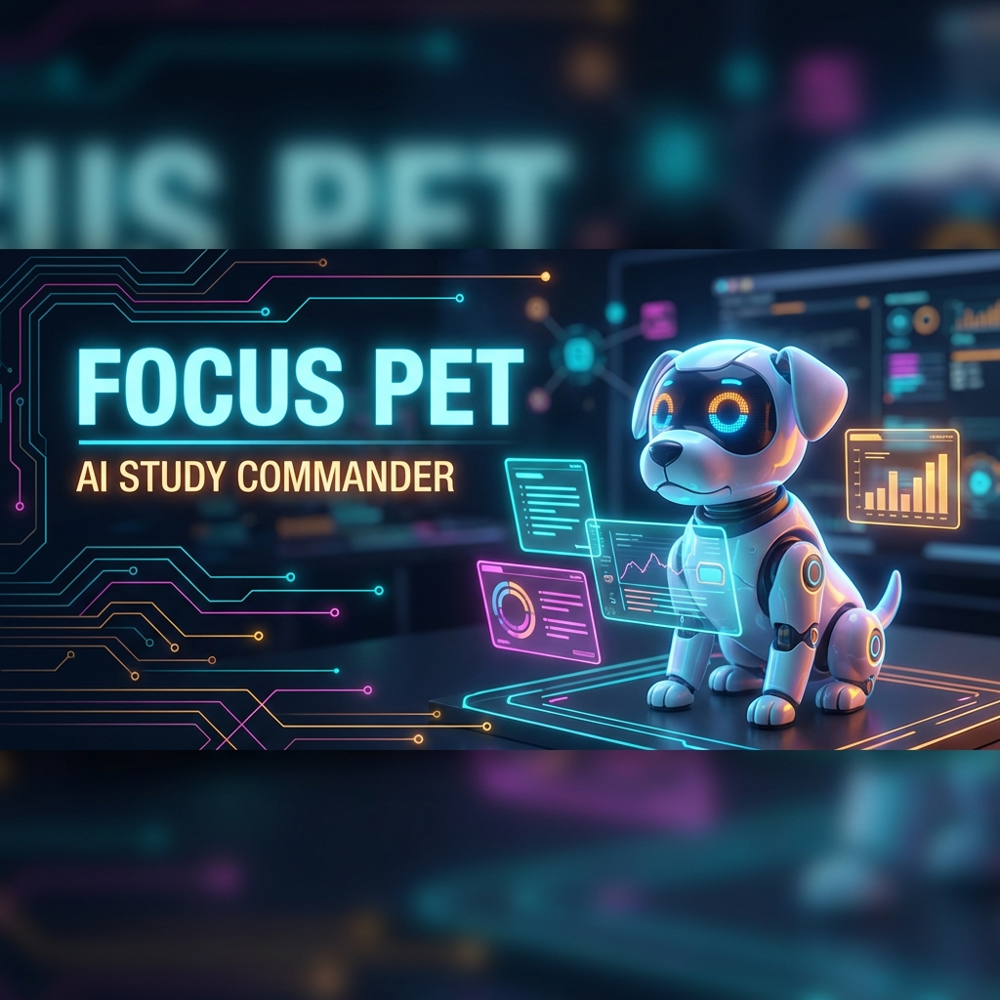

<div align="center">
  
  <br>

  <h1>🧠 Focus Pet: AI Study Commander</h1>
  
  <p>
    <strong>Gamify Your Focus. Master Your Learning Style. Save Your Virtual Companion.</strong>
  </p>

  <p>
    <a href="#-about">About</a> •
    <a href="#-features">Features</a> •
    <a href="#-tech-stack">Tech Stack</a> •
    <a href="#-getting-started">Getting Started</a> •
    <a href="#-contributing">Contributing</a>
  </p>

  <p>⭐ Star us on GitHub if this project helped you study! ⭐</p>
</div>

---

## 🚀 About

**Focus Pet** transforms the solitary act of studying into an engaging mission. Struggling with distractions? Your virtual companion's life depends on your focus! 

Built for **TinkerHack 2026**, this application combines psychological learning science with tamagotchi-style gamification to keep you in the zone.

### Why Focus Pet?
- **Personalized Learning**: Are you a Visual, Auditory, Read/Write, or Kinesthetic learner? Our AI adapts content to *your* brain.
- **High Stakes Focus**: Open a distraction tab? Your pet loses health. Stay focused? Watch them thrive.
- **Instant Resource Generation**: Upload a boring PDF, and we'll turn it into an interactive dashboard tailored to your learning style.

## ✨ Features

- **🧩 Intelligent Style Assessment**: Take our adaptive quiz to discover your optimal learning path.
- **🐶 Virtual Companions**: adopt **Sparky** (Puppy), **Git** (Kitten), or **Pixel** (Hamster).
- **❤️ Dynamic Health System**:
    - **Heal**: Stay on the study tab.
    - **Damage**: Lose focus (alt-tab, blur window).
    - **Critical**: Too many distractions lead to a "Game Over" for your session.
- **📚 Adaptive Study Dashboard**:
    - **Visual**: Flowcharts, diagrams, and video curation.
    - **Auditory**: AI-generated podcast scripts and conversational explanations.
    - **Read/Write**: Structured summaries and bulleted deep-dives.
    - **Kinesthetic**: Active challenges and "Try This" experiments.
- **🤖 Document Intelligence**: Powered by OpenAI to parse documents and generate custom study aids.

## 🛠 Tech Stack

### Frontend
- **Framework**: [Svelte 5](https://svelte.dev/) (Latest & Greatest!)
- **Build Tool**: [Vite](https://vitejs.dev/)
- **Styling**: Custom CSS with Glassmorphism aesthetic

### Backend
- **Runtime**: Node.js & Express
- **Database**: MongoDB (Mongoose)
- **AI Integration**: OpenAI API
- **File Handling**: Multer & PDF-Parse

## 🏁 Getting Started

Follow these steps to set up the project locally.

### Prerequisites
- Node.js (v18+)
- MongoDB running locally or a connection string
- OpenAI API Key

### Installation

1.  **Clone the Repository**
    ```bash
    git clone https://github.com/varshaannbijuu/tinkerhack.git
    cd tinkerhack
    ```

2.  **Frontend Setup**
    ```bash
    # Install dependencies
    npm install

    # Start the development server
    npm run dev
    ```
    The app will be available at `http://localhost:5173`.

3.  **Backend Setup**
    Open a new terminal:
    ```bash
    cd backend

    # Install dependencies
    npm install

    # Configure Environment Variables
    # Create a .env file in /backend with:
    # PORT=3000
    # MONGODB_URI=your_mongodb_uri
    # OPENAI_API_KEY=your_openai_key

    # Start the server
    npm run dev
    ```
    The server will run on `http://localhost:3000`.

## 🤝 Contributing

We welcome contributions! Please fork the repository and submit a Pull Request.

1.  Fork the Project
2.  Create your Feature Branch (`git checkout -b feature/AmazingFeature`)
3.  Commit your Changes (`git commit -m 'Add some AmazingFeature'`)
4.  Push to the Branch (`git push origin feature/AmazingFeature`)
5.  Open a Pull Request

## 📄 License

Distributed under the MIT License. See `LICENSE` for more information.

---

<div align="center">
  <sub>Built with 💖 by the TinkerHack Team</sub>
</div>
